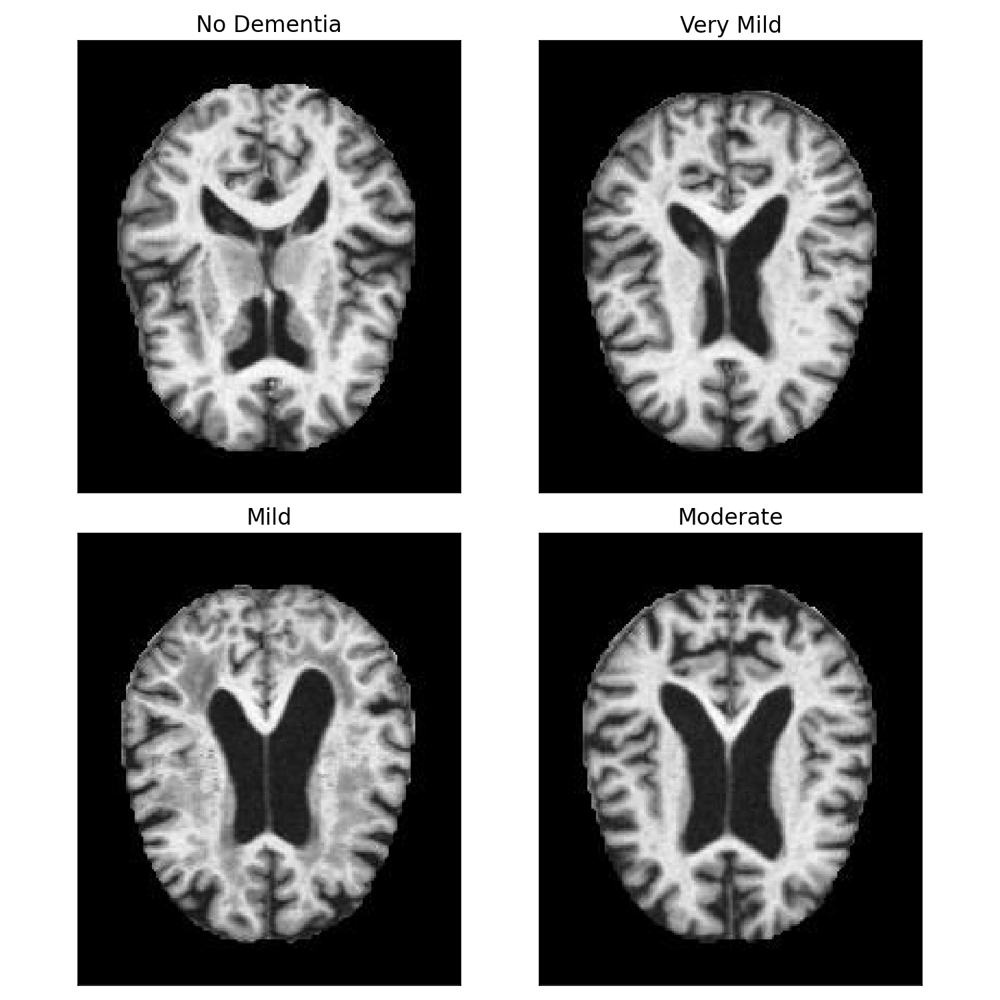
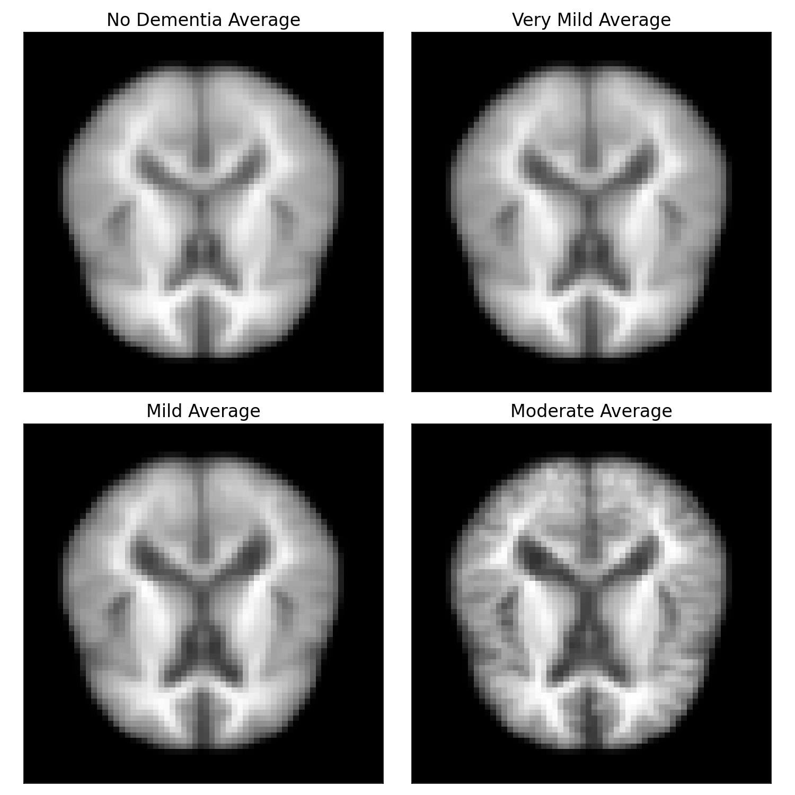
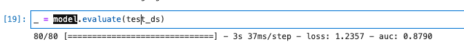

# Background & Motviation
Alzheimer's disease, a progressive neurodegenerative disorder, is the most common cause of dementia in the elderly population. Early diagnosis of this condition is crucial, as it allows for timely intervention and better management, potentially slowing down its progression. Traditional diagnostic methods involve cognitive testing and medical examinations which, while effective, can sometimes be inconclusive or lead to late-stage diagnosis when the disease has already advanced.

Recent advancements in neuroimaging have revealed distinct patterns and changes in the brains of Alzheimer's patients. Techniques such as Magnetic Resonance Imaging (MRI) and Positron Emission Tomography (PET) scans have become invaluable tools in the identification of structural and functional anomalies linked to the disease. However, the interpretation of these imaging modalities can be complex and time-consuming, requiring expert radiologists to identify subtle changes in the brain.

In this data science project, we leverage the power of Convolutional Neural Networks (CNN) to analyze brain imaging data from Alzheimer's patients. CNNs, a class of deep learning algorithms, are particularly adept at processing image data and have shown promise in various medical imaging applications. By training a CNN on a large dataset of brain scans, we aim to develop a model that can automatically detect early signs of Alzheimer's with high accuracy, providing a supplementary diagnostic tool to assist medical professionals in their assessments.

# The Data
Kaggle offers an [Alzheimer's Dataset](https://www.kaggle.com/tourist55/alzheimers-dataset-4-class-of-images) featuring 4 stages of MRI images split into training as well as test sets. These files are stored as a jpg image file. 

The training data set includes:
* No Dementia- 2,560 images
* Very Mild Dementia - 1,792 images
* Mild Dementia - 717 images
* Moderate Demented - 52 images

The test data set includes:
* No Dementia - 640 images
* Very Mild Dementia - 448 images
* Mild Dementia - 179 images
* Moderate Demented - 12 images

 

  

# EDA

## Averages of brains by category
 

  

 

 

# Convolutional Neural Network 

# Modeling 
## **Training / Testing**

* Image Size = 64x64
* Batch Size = 32
* Epochs = 100
* Training/Validation Split = .20

It is recommended to use smaller image sizes for computational efficiency as well as a 80/20 split for the training data so it can be tested and validated prior to running my test data.

## **Model Selection**

### **Hyperparameters**
* Optimizer: Adam 
* Loss: Catagorical Crossentropy 
* Metrics: AUC
* Epoch: 100

### **Results** 
|  Test Data       |  Rate  
| --------------- |-------:|
| AUC    |  0.8790   | 

 

# Conclusions 
Model had an AUC score of 0.879 on validation data. Considering that there is a 1/4 chance of correctly predicting the target given the 4 different classes the model seems to have learned some qualities of the images to predict.

Because training a model is quite computationally expensive to do locally and with limited cpu/gpu power. Trying all these parameters proved to be too time consuming but with more time and resources a better model could likely be found/optimized.

# Future Directions
Model performed 2x better than chance but there is still much to be improved on. These features would include further work with image generation, weights, thresholds, and image segmentation.

# Citations 
Data - 

[Kaggle](https://www.kaggle.com/tourist55/alzheimers-dataset-4-class-of-images)
